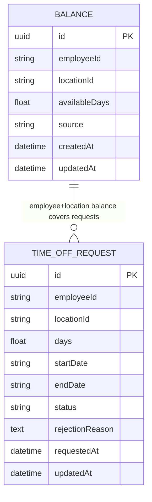
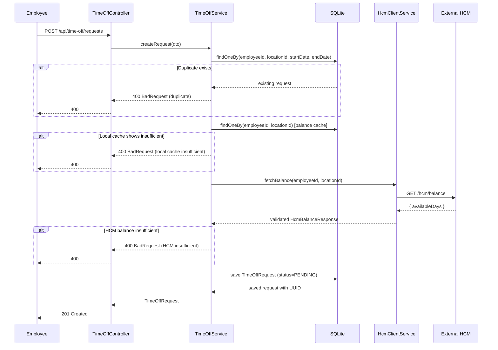
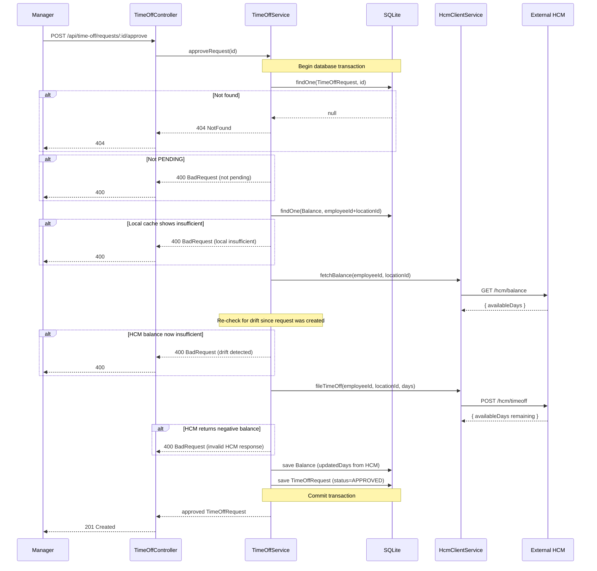
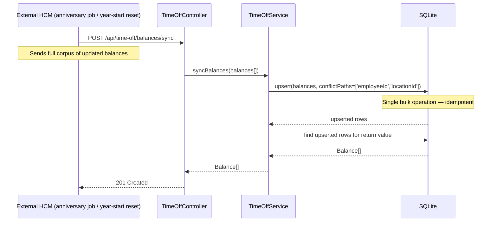
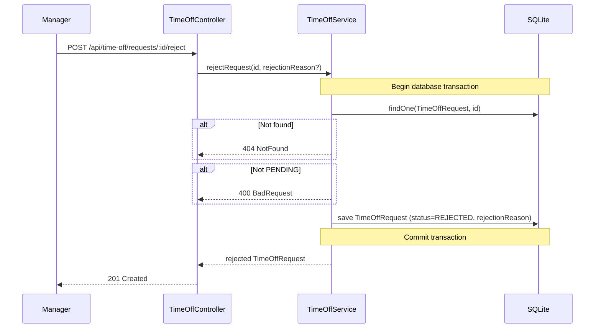

# Architecture — Time-Off Microservice

This document describes the system architecture, module structure, data schema, and request flows for the ExampleHR / ReadyOn Time-Off Microservice.

---

## Table of Contents

1. [System Context](#system-context)
2. [Module Structure](#module-structure)
3. [Component Responsibilities](#component-responsibilities)
4. [Entity Relationship Diagram](#entity-relationship-diagram)
5. [Database Schema](#database-schema)
6. [Request Flow Diagrams](#request-flow-diagrams)
7. [Two-Layer Validation Model](#two-layer-validation-model)
8. [Error Handling Architecture](#error-handling-architecture)
9. [Embedded HCM Mock Architecture](#embedded-hcm-mock-architecture)

---

## System Context

```
┌─────────────────────────────────────────────────────────────────┐
│                        ExampleHR / ReadyOn                      │
│                                                                 │
│   ┌──────────────────────────────────────────────────────────┐  │
│   │               Time-Off Microservice (NestJS)            │  │
│   │                                                          │  │
│   │  POST /api/time-off/requests                            │  │
│   │  POST /api/time-off/requests/:id/approve                │  │
│   │  POST /api/time-off/requests/:id/reject                 │  │
│   │  GET  /api/time-off/requests                            │  │
│   │  GET  /api/time-off/balances                            │  │
│   │  POST /api/time-off/balances/sync                       │  │
│   │                                                          │  │
│   │  SQLite (local balance cache + request state)           │  │
│   └────────────────────────┬─────────────────────────────────┘  │
│                            │ HTTP                                │
└────────────────────────────┼────────────────────────────────────┘
                             │
                             ▼
              ┌──────────────────────────┐
              │  External HCM System     │
              │  (Workday / SAP / etc.)  │
              │                          │
              │  GET  /hcm/balance       │
              │  POST /hcm/timeoff       │
              │  POST /hcm/batch-sync    │
              └──────────────────────────┘

Other external actors that can update HCM independently:
  - HR admin portals
  - Anniversary bonus automation
  - Year-start balance reset jobs
```

---

## Module Structure

```
src/
├── app.module.ts                  ← Root module: ConfigModule, TypeORM, TimeOffModule, CommonModule, HcmModule
├── main.ts                        ← Bootstrap: global prefix, global pipes, Swagger
│
├── common/
│   ├── common.module.ts           ← Exports HcmClientService
│   └── hcm-client.service.ts     ← HTTP client for HCM, error handling, response validation
│
├── hcm/                           ← Embedded HCM mock (dev + testing)
│   ├── hcm.module.ts
│   ├── hcm.controller.ts          ← GET /hcm/balance, POST /hcm/timeoff, POST /hcm/batch-sync
│   ├── hcm.service.ts             ← In-memory balance map, balance deduction logic
│   └── dto/hcm.dto.ts
│
└── time-off/
    ├── time-off.module.ts
    ├── time-off.controller.ts     ← HTTP routes, ValidationPipe, delegates to service
    ├── time-off.service.ts        ← All business logic, transactions, HCM orchestration
    ├── time-off.service.spec.ts   ← Unit tests
    │
    ├── dto/
    │   ├── create-time-off-request.dto.ts   ← Includes DaysWithinDateRange cross-field validator
    │   ├── get-balance.dto.ts               ← Validates required employeeId + locationId
    │   ├── reject-time-off-request.dto.ts   ← Optional rejectionReason with MinLength
    │   └── sync-balance.dto.ts              ← Nested array validation with ValidateNested
    │
    └── entities/
        ├── balance.entity.ts                ← Unique(employeeId, locationId)
        └── time-off-request.entity.ts       ← Status enum: PENDING / APPROVED / REJECTED

test/
└── app.e2e-spec.ts                ← Full stack e2e with real HTTP mock HCM server
```

---

## Component Responsibilities

| Component | Responsibility |
|---|---|
| `TimeOffController` | HTTP route definitions, request parsing, delegates all logic to `TimeOffService` |
| `TimeOffService` | All business rules: duplicate detection, two-layer balance validation, transaction management, lifecycle state machine |
| `HcmClientService` | HTTP calls to external HCM, response structure validation, typed error translation (`HcmUnavailableException`, `HcmInsufficientBalanceException`) |
| `CommonModule` | Provides and exports `HcmClientService` to any feature module that needs it |
| `HcmController` + `HcmService` | Embedded in-process mock of HCM for local development and e2e testing |
| `Balance` entity | Local cache: one row per `(employeeId, locationId)`, updated on every HCM interaction |
| `TimeOffRequest` entity | Lifecycle record: captures every request submission, its days/dates, and its current status |

---

## Entity Relationship Diagram



**Relationship note:** There is no foreign key between the two tables. Both are keyed by the `(employeeId, locationId)` pair, which is the natural composite key of the domain. This is intentional — a `TimeOffRequest` can exist before a `Balance` row has been synced.

---

## Database Schema

### `balance`

```sql
CREATE TABLE balance (
  id            TEXT PRIMARY KEY,        -- UUID
  employeeId    TEXT NOT NULL,
  locationId    TEXT NOT NULL,
  availableDays REAL NOT NULL,           -- supports half-days
  source        TEXT NOT NULL DEFAULT 'HCM',
  createdAt     DATETIME NOT NULL DEFAULT CURRENT_TIMESTAMP,
  updatedAt     DATETIME NOT NULL DEFAULT CURRENT_TIMESTAMP,
  UNIQUE (employeeId, locationId)
);
```

### `time_off_request`

```sql
CREATE TABLE time_off_request (
  id              TEXT PRIMARY KEY,       -- UUID
  employeeId      TEXT NOT NULL,
  locationId      TEXT NOT NULL,
  days            REAL NOT NULL,          -- supports half-days
  startDate       TEXT NOT NULL,          -- ISO date string e.g. 2026-05-05
  endDate         TEXT NOT NULL,          -- ISO date string e.g. 2026-05-06
  status          TEXT NOT NULL DEFAULT 'PENDING',  -- PENDING | APPROVED | REJECTED
  rejectionReason TEXT,                   -- nullable
  requestedAt     DATETIME NOT NULL DEFAULT CURRENT_TIMESTAMP,
  updatedAt       DATETIME NOT NULL DEFAULT CURRENT_TIMESTAMP
);
```

---

## Request Flow Diagrams

### Flow 1 — Create Time-Off Request



---

### Flow 2 — Approve Request



---

### Flow 3 — Batch Balance Sync (HCM push)



---

### Flow 4 — Reject Request



---

## Two-Layer Validation Model

```
                    Request or Approval arrives
                              │
                              ▼
               ┌──────────────────────────────┐
               │  Layer 1: Local Cache Check  │
               │  (SQLite, zero latency)       │
               └──────────────┬───────────────┘
                              │
                   Is local cache present?
                      AND availableDays < days?
                              │
                  YES ────────┘         NO (or no cache)
                   │                          │
                   ▼                          ▼
              400 Reject             ┌──────────────────────────┐
              (fast fail,            │  Layer 2: HCM Live Check │
               no HCM call)         │  (network call, always   │
                                    │   runs for writes)        │
                                    └──────────┬───────────────┘
                                               │
                                   availableDays < days?
                                               │
                               YES ────────────┘       NO
                                │                       │
                                ▼                       ▼
                           400 Reject              Proceed with
                                                  write operation
```

**Key principle:** Layer 1 is an optimisation — it avoids unnecessary HCM network calls when the local cache already has a definitive answer. Layer 2 is the authoritative gate — it always runs before any state-changing operation and cannot be bypassed.

---

## Error Handling Architecture

```
HCM Call
   │
   ├── HTTP 2xx → validateBalanceResponse()
   │      ├── Missing fields / wrong types → HcmUnavailableException (503)
   │      └── availableDays < 0           → HcmInsufficientBalanceException (400)
   │
   ├── HTTP 400 / 409 → HcmInsufficientBalanceException (400)
   │
   ├── HTTP 5xx / timeout / ECONNREFUSED → HcmUnavailableException (503)
   │
   └── Own typed exception re-thrown → not wrapped again
```

All HCM errors are caught in `HcmClientService.handleHcmError()`. This method is a `never`-returning function — it always throws, which allows TypeScript to correctly infer that callers after the `try/catch` have a defined return value.

---

## Embedded HCM Mock Architecture

```
┌────────────────────────────────────────┐
│           HcmModule (src/hcm/)         │
│                                        │
│  HcmController                         │
│  ├── GET  /hcm/balance                 │
│  ├── POST /hcm/timeoff                 │
│  └── POST /hcm/batch-sync             │
│              │                         │
│  HcmService                            │
│  ├── Map<"empId:locId", number>        │  ← in-memory state
│  ├── defaultBalance = 10               │
│  ├── getBalance()                      │
│  ├── fileTimeOff()   → throws 400 if insufficient
│  └── batchSync()     → overwrites map entries
└────────────────────────────────────────┘
```

**Used in:**
- Local development — `HCM_API_BASE_URL=http://localhost:3000` points to the same process
- E2E tests — a separate real Node.js HTTP server is created from the same logic, listening on a random port, so tests are isolated from application state