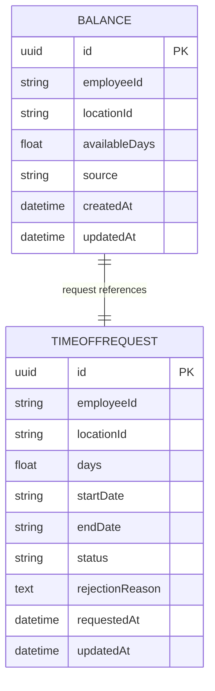
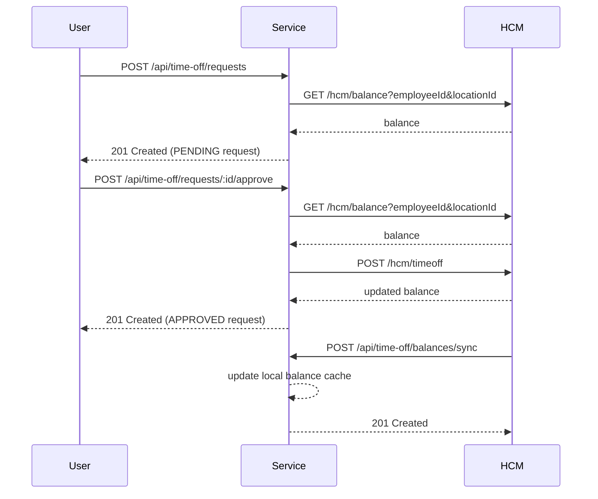

# Architecture Diagram and Schema

This document shows the database schema and API flow for the Time-Off Microservice.

## Entity Relationship Diagram (ERD)

### Database schemas

#### `balance`
- `id` (UUID, PK)
- `employeeId` (string)
- `locationId` (string)
- `availableDays` (real)
- `source` (string)
- `createdAt` (datetime)
- `updatedAt` (datetime)
- Unique key: `(employeeId, locationId)`

#### `time_off_request`
- `id` (UUID, PK)
- `employeeId` (string)
- `locationId` (string)
- `days` (real)
- `startDate` (string)
- `endDate` (string)
- `status` (string: `PENDING`, `APPROVED`, `REJECTED`)
- `rejectionReason` (text, nullable)
- `requestedAt` (datetime)
- `updatedAt` (datetime)

## API Flow Diagram

## API Schema Summary

- `POST /api/time-off/requests`
  - Body: `{ employeeId, locationId, days, startDate, endDate }`
  - Validates HCM balance before creating a pending request.
- `POST /api/time-off/requests/:id/approve`
  - Approves a pending request.
  - Validates HCM balance again and files the time-off with HCM.
- `GET /api/time-off/requests`
  - Query: `employeeId`, `locationId`
  - Returns request history filtered by employee and location.
- `GET /api/time-off/balances`
  - Query: `employeeId`, `locationId`, `refresh`
  - Returns cached balance and can refresh from HCM.
- `POST /api/time-off/balances/sync`
  - Body: `{ balances: [{ employeeId, locationId, availableDays }] }`
  - Updates local balance cache from HCM batch data.

## System Flow Overview

1. User requests time off.
2. Service fetches the latest balance from HCM.
3. If balance is sufficient, a pending request is created.
4. Manager approves request, service files the time off with HCM.
5. HCM updates local cache and service keeps data in sync.
